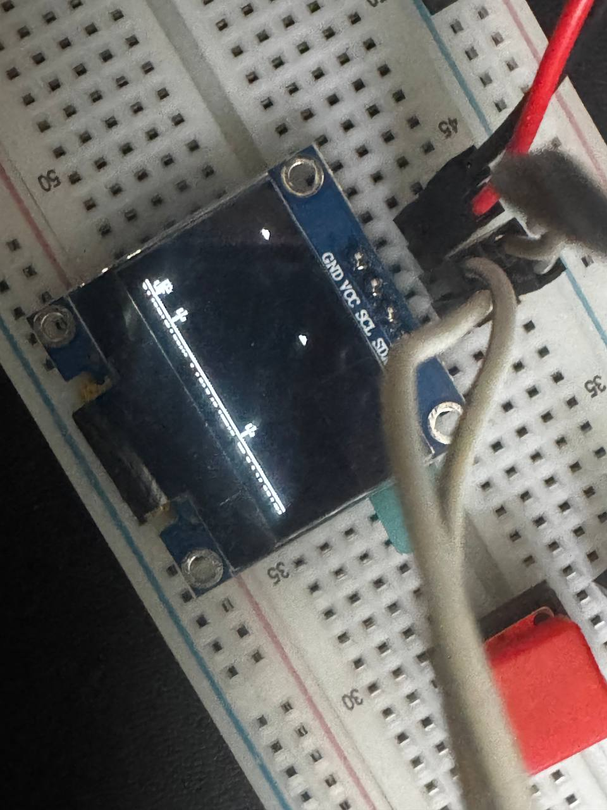

## picodino

An incomplete and only mildly fun implementation of the popular T-Rex Chrome Dino game
running on a RPi Pico 2W, and a cheap 0.96in OLED SSD1306 display. Built with embassy-rs.

### Why?

Freewill, and, because I was trying to learn embassy-rs.
